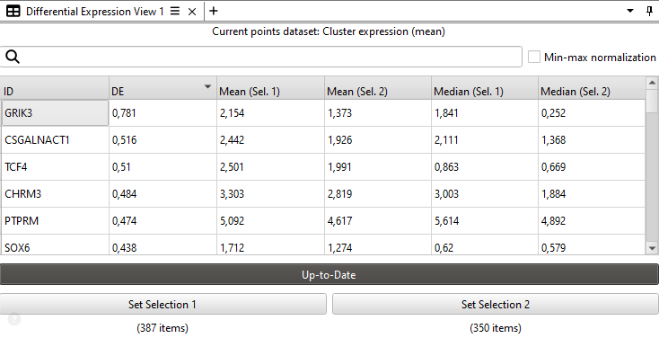

# Differential Expression Viewer

View plugin for the [ManiVault Studio](https://github.com/ManiVaultStudio/core) framework for a basic comparison of genetic expression levels between selections (differential expression).

```bash
git clone https://github.com/ManiVaultStudio/DifferentialExpressionPlugin.git
```

This plugin captures variability between user-selected subsets by comparing the difference between averages for each dimension of all points the subsets (dimensions could for example be gene expression and points could be cells).

<p align="middle">
    
</p>

Information on more in-depth differential expression techniques can be found in many places, e.g. in _Differential gene expression analysis pipelines and bioinformatic tools for the identification of specific biomarkers: A review_ (2024, [10.1016/j.csbj.2024.02.018](https://doi.org/10.1016/j.csbj.2024.02.018)).

## How to use

1. Load a point data set, either via right-click in the data hierarchy and selecting `View -> Differential Expression`, by or opening an empty widget with the main toolbar with `View -> Differential Expression View` and then dragging-and-dropping the data into the small field that ask for a dataset.
2. Make two selection in the data, e.g. via a [scatterplot](https://github.com/ManiVaultStudio/Scatterplot) view. Save each selection via the two buttons at the bottom of the view.
3. Click the button above the selection-setters to compute the differential expression.

The "Min-max normalization" option scales both mean (and median) of each selection values with `(selection_mean - global_min) / (global_max - global_min)`.
