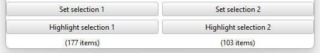
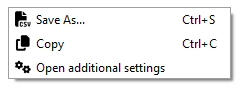

# Other features

Besides the main DE computation functionality laid out in the [main readme](../README.md), this plugin has other - some of them hidden - features.

## Highlight selection

After setting selections, you can highlight them again via the "Highlight selection X" buttons

    

## Save DE

    

A right-click in the widget will reveal a context menu with two entries regarding saving the currently shown DE analysis:
1. `Save as...`: Save the DE table as a csv file to disk,
2. `Copy`: Make the DE table available in the clipboard for you to paste it anywhere.

## Additional settings
The last entry in the context menu will open an `Additional settings` dialog.
Currently, this dialog hosts one option:
1. `Selection mapping source`: A data set picker, which will only display point data sets that have a selection map (linked data) to the currently loaded data set. Selecting a data set here will influence the selection highlighting. If a valid data set is selected as a selection source (i.e. the selection mapping covers the entire current data set), highlighting a selection will set the selection in the selection source data. Then can come in handy when the current selection was not made in the loaded data but in the selection source data, which in turn mapped the selection internally (but no automatic reverse mapping is performed).
